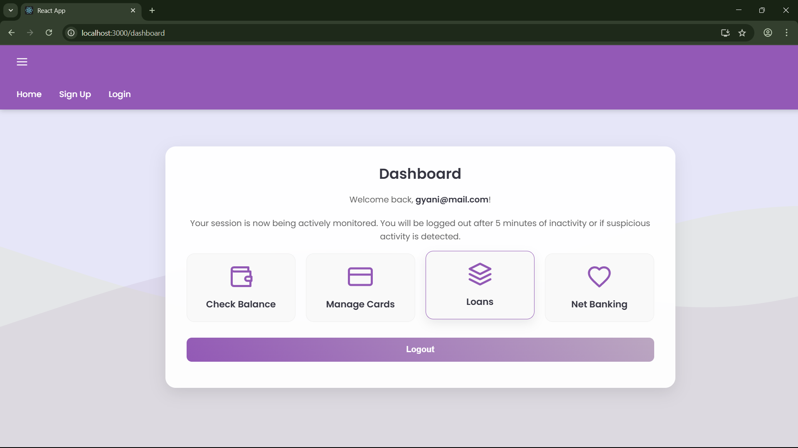
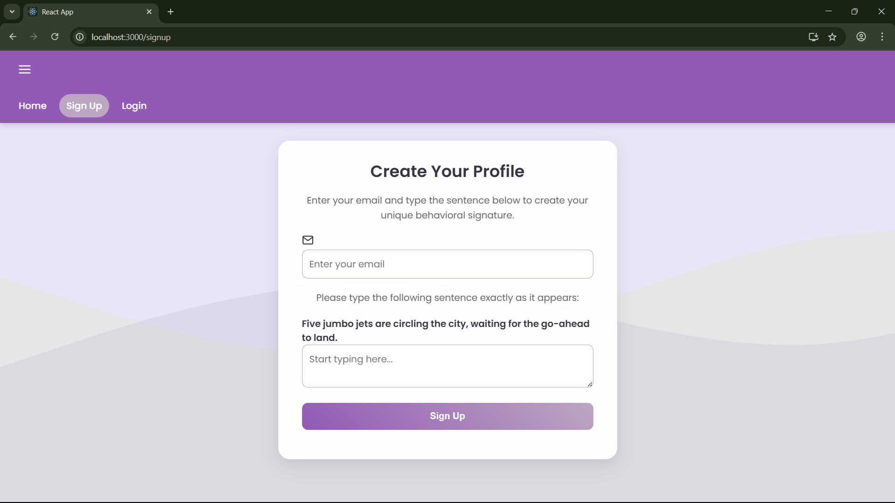
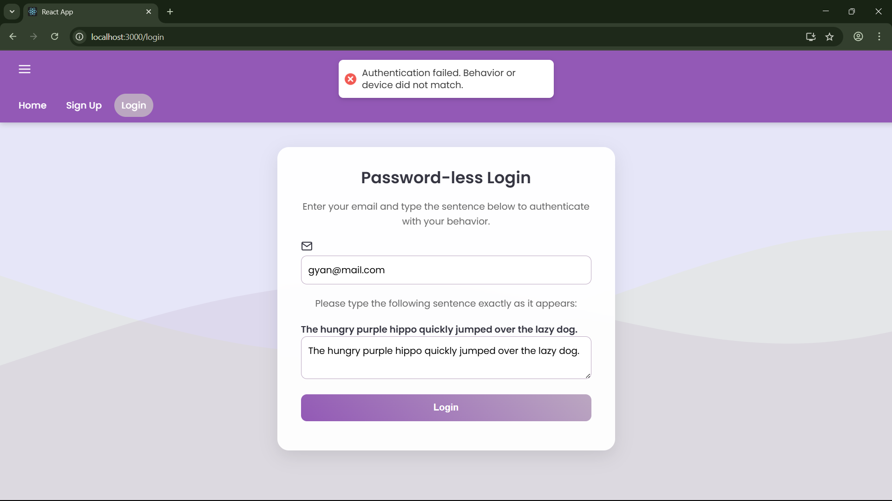

# Behavioral Biometric Authentication System

A full-stack, password-less authentication platform for secure banking, designed to differentiate between legitimate users and fraudsters using a multi-layered trust score based on behavioral biometrics, device fingerprinting, and contextual data.

---



## 1. Problem Statement

The challenge was to develop a solution for modern digital banking that addresses the vulnerabilities of traditional authentication methods. The system needed to prevent impersonation fraud at registration and provide a secure, password-less login experience that is resistant to common attacks like phishing. Key requirements included detecting suspicious activity based on location, device, and user behavior, and providing a stronger alternative to passwords.

## 2. Our Solution: A Multi-Layered, Dynamic Trust Score Engine

We have engineered a full-stack web application that replaces passwords with a dynamic, multi-layered security model. Instead of a simple pass/fail login, our solution calculates a real-time **"Trust Score"** for every authentication attempt. This score is an aggregate of several independent security checks, and access is only granted if the score surpasses a dynamically calculated threshold, making the system both highly secure and intelligent.


 | 


| Sign Up Page | Login Page |
| :---: | :---: |
|  |  |

## 3. Key Features

Our solution is built upon several layers of security that work in concert to build a comprehensive user profile and detect anomalies.

* **Behavioral Biometrics:** The core of our system analyzes a user's unique "behavioral signature" based on their typing and mouse dynamics. This is **text-agnostic**, meaning it recognizes the *pattern* of interaction, not the specific words typed.
    * **Typing Speed & Rhythm:** Measures the user's average keystroke time and the consistency of their typing rhythm (standard deviation).
    * **Mouse Dynamics:** Tracks the user's average cursor movement speed.

* **Device Fingerprinting:** Creates a unique and persistent hash ID for each user's browser, flagging logins from unrecognized devices as higher risk.

* **IP Reputation & Geolocation:** Automatically checks the user's IP address to detect high-risk proxies/VPNs and verifies if the login country matches the user's country of origin.

* **Dynamic Trust Thresholds:** The "brain" of our system. The required trust score intelligently adapts to the context of the login attempt. A login from a trusted device and location requires a lower score than a login from a new, unrecognized context.

* **Continuous Authentication:** Security doesn't stop at login. The application continues to monitor the user's behavior on the dashboard and will automatically terminate the session if a behavioral anomaly is detected.

* **Idle Timeout:** Users are automatically logged out after 5 minutes of inactivity to prevent unauthorized access on unattended machines.

* **Secure Architecture:**
    * All API communication is secured using **JSON Web Tokens (JWT)** stored in http-only cookies.
    * Sensitive credentials are kept out of the source code in a `.env` file.

* **Modern UI/UX:** The application features a polished, responsive user interface with a fixed navigation bar, professional toast notifications, loading states, and real-time form validation.

## 4. Tech Stack

* **Frontend:** React.js, React Router, Axios, React Hot Toast
* **Backend:** Node.js, Express.js
* **Database:** MongoDB with Mongoose
* **Security:** JSON Web Token (JWT), `dotenv`, `cookie-parser`, Fingerprint2.js
* **Styling:** Custom CSS with Google Fonts

## 5. How to Run This Project

To run this project locally, you will need Node.js and MongoDB installed on your machine.

### Backend Setup

1.  Navigate to the `backend` directory:
    ```bash
    cd backend
    ```
2.  Install the necessary dependencies:
    ```bash
    npm install
    ```
3.  Create a `.env` file in the `backend` directory and add your MongoDB connection string and a JWT secret:
    ```
    MONGODB_URI=mongodb://localhost:27017/secure_banking
    JWT_SECRET=your_super_secret_key
    ```
4.  Start the backend server:
    ```bash
    node server.js
    ```
    The server will be running on `http://localhost:5001`.

### Frontend Setup

1.  Open a new terminal and navigate to the `frontend` directory:
    ```bash
    cd frontend
    ```
2.  Install the necessary dependencies:
    ```bash
    npm install
    ```
3.  Start the React application:
    ```bash
    npm start
    ```
    The application will open in your browser at `http://localhost:3000`.

